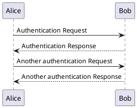
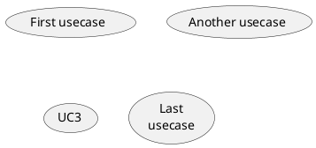
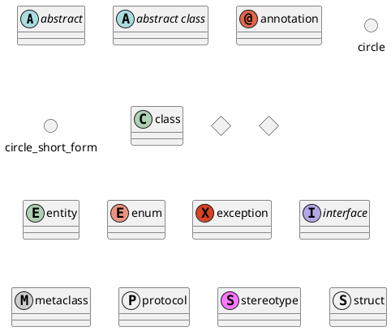
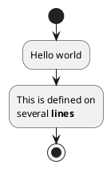

# lume-plugin-plantuml

## Sequence

```plantuml
@startuml
Alice -> Bob: Authentication Request
Bob --> Alice: Authentication Response

Alice -> Bob: Another authentication Request
Alice <-- Bob: Another authentication Response
@enduml
```

## Use Case

```plantuml
@startuml
(First usecase)
(Another usecase) as (UC2)
usecase UC3
usecase (Last\nusecase) as UC4
@enduml
```

## Class

```plantuml
@startuml
abstract        abstract
abstract class  "abstract class"
annotation      annotation
circle          circle
()              circle_short_form
class           class
diamond         diamond
<>              diamond_short_form
entity          entity
enum            enum
exception       exception
interface       interface
metaclass       metaclass
protocol        protocol
stereotype      stereotype
struct          struct
@enduml
```

## Activity(New)

```plantuml
@startuml
start
:Hello world;
:This is defined on
several **lines**;
stop
@enduml
```
